# subarr

The coordination layer for the *arr subtitle stack. Stands beside Bazarr.

Subarr decides what subtitles are actually missing across your library, which providers are worth your time, and when it is worth running Whisper. Bazarr finds and downloads. Subgen transcribes. Subarr coordinates.

[](https://github.com/coaxk/subarr)
[](https://github.com/coaxk/subarr/actions/workflows/ci.yml)
[](#security)
[](LICENSE)

> Built with AI assistance from Claude. Code is open, every PR is human-reviewed. Telemetry, security scans, and a published test count are how we stay honest about that.

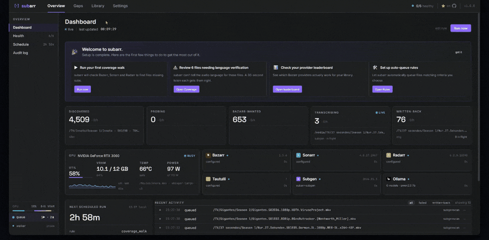

---

## New in 1.5

- **Multiple media locations (libraries).** Your library no longer has to live under one root. Model each location — a second disk, a 4K share, an anime mount — as a library with its own subgen and *arr path prefixes. Auto-suggested from your Sonarr/Radarr root folders in Settings → Libraries (plus a manual add form), validated live, applied without a restart. Existing single-root installs change nothing — zero migration.
- **Runs on your Pi — multi-arch images.** `ghcr.io/coaxk/subarr` now publishes linux/arm64 alongside amd64. Pi 4/5 users: no more exec-format errors, no more building locally.
- **Coverage stays trustworthy through restarts.** A transient Sonarr/Bazarr hiccup during a build (the stack-restart special) used to replace your coverage snapshot with an all-"Analyzing" wall for ~10 minutes. Degraded builds are now held — the last good snapshot keeps serving until the stack is actually back.
- **Crash visibility, fleet edition.** When a background loop fails, subarr now (with telemetry on) reports the exception type + module:line + count — never messages, tracebacks, or paths. A release regression that slips past CI shows up across the fleet in hours instead of festering silently. Full detail stays local on the Health page; the transparency panel shows exactly what's sent.
- **Search actually searches.** Library search results now drill down (clicking a matched show shows its seasons), and the Coverage title/path search box is a real input that filters the table.

*Job Aftercare, default-track mismatch fix, and queue authority landed in 1.4; the Tuning Lab and audio-language verification in 1.2; speech-aware audio (silero VAD) in 1.1. See the [changelog](CHANGELOG.md) for the full history.*

---

## In one breath

- **See your whole library's subtitle coverage at a glance.** Per-language gap view across Sonarr + Radarr + Bazarr, with audio language we trust.
- **We verify before we call it a gap.** A row only becomes an actionable gap once subarr has actually probed the file — so it never queues something that already has an embedded sub subgen would skip. Un-probed files wait in a visible "Analyzing" bucket, not silently dropped or falsely surfaced.
- **Calibrated audio language detection.** Three Whisper chunks across the file, conservative voting, confidence-gated. Cheap to skip files Whisper would hallucinate on.
- **We don't parrot the metadata, we verify it.** Subarr listens to the actual audio and tells a mislabeled track from a bilingual one from "genuinely unsure", then offers a one-click fix that flows back into coverage. Beside Bazarr, never instead of it.
- **Tune Whisper to your hardware.** The Tuning Lab sweeps recipe variants against your live subgen, a validated judge ranks them, and a per-language leaderboard surfaces the dependable default for each language.
- **Don't burn GPU on content nobody watches.** Scheduled walks with backpressure. Tautulli playback signal influences priority.
- **Provenance ledger.** Which provider gave you which sub, when, why. Survives re-search runs.
- **Embedded subs are first-class.** SDH, forced, PGS, full, all distinguished, not collapsed.

## Five-minute install

```yaml
# compose.yaml
services:
  subarr:
    image: ghcr.io/coaxk/subarr:latest
    container_name: subarr
    restart: unless-stopped
    ports:
      - "9922:9922"
    environment:
      - PUID=1000
      - PGID=1000
      - TZ=Etc/UTC
      - UMASK=022
      - SUBARR_DB_PATH=/data/subarr.db     # SQLite + persisted settings live here
    volumes:
      - ./subarr/data:/data                # subarr.db (override the path with SUBARR_DB_PATH)
      - /path/to/media:/media/library:rw   # same path Bazarr and subgen see
```

```bash
docker compose up -d
# Open http://localhost:9922, onboarding wizard auto-detects your stack.
```

The wizard tries to auto-detect Sonarr/Radarr/Bazarr/Tautulli/subgen on your existing Docker network and prefills URLs. Manual entry is available at every step as a safety net. Auto-detect plus manual fallback at every step is the design rule.

After onboarding you can edit any integration's URL and API key (and the Plex token) directly in Settings, with test-connection and live apply. Values you set via env vars stay authoritative and show as read-only.

**Why `:rw` on the media mount.** Subarr's sidecar mismatch detector renames orphaned `.srt` files whose basename drifted from the video. Read-only blocks this. If you don't want it, set `SUBARR_SIDECAR_RENAME=0` and mount `:ro`, the rest of the product works.

**Plex (optional).** Set `PLEX_URL` + `PLEX_TOKEN` (and optionally `PLEX_SECTION`) to enable two things: an instant Plex library refresh the moment subarr writes a sub (instead of waiting for Plex's own periodic scan), and the opt-in per-show audio-language read (`PLEX_AUDIO_HINTS=1`). Plex shows in the dashboard + Settings integration health either way, so you can see its status at a glance. Activity/now-playing still comes through Tautulli.

## Two ways to use subarr

Pick whichever fits how you work. You can do both.

**Simple, "I just want a real frontend for subgen".** Install subarr, open the Library tab, tick a file or a folder or a whole series, hit "Queue for transcription". Watch it run. Re-queue, cancel, see what failed and why. Same way you'd use Sonarr's queue for downloads. No coverage walks, no rules, no scheduler. Just a working UI on top of subgen.

**Advanced, "tell me what I should fix first".** Open the Coverage tab. Subarr has already walked your library and sorted gaps by score with reason chips per row (no track, embedded-only, bazarr-wanted, audio-mislabel, low-score, unmonitored). Apply auto-queue rules, run scheduled walks, integrate Tautulli playback signal into priority. Set it up once, walk away. Subarr decides what's worth running.

Most installs start simple and grow into advanced as the coverage walk surfaces things worth doing. Nothing forces the move; both are valid forever.

## I already have subgen. What do I do?

The most-asked question. Quick answer.

| You have | What to do |
|---|---|
| Vanilla `mccloud/subgen` | Keep it. Add subarr next to it. Subarr detects vanilla and runs in compat mode. Coverage, provenance, scheduling, audio-language review all work. You miss calibrated multi-chunk detection and queue cancel, both require our subgen patches. |
| `mccloud/subgen` and you want everything | Swap to `ghcr.io/coaxk/subarr-subgen`. Same upstream image plus 20 small auditable patches. Pull, change one line in your compose, restart. No data loss, no config rewrite. |
| No subgen yet | Start with `ghcr.io/coaxk/subarr-subgen`. Everything works on day one. |
| You run Bazarr only | Subarr adds a coordination layer beside Bazarr. Bazarr keeps doing what it does. Subarr surfaces what is actually missing, schedules the work, and writes results back. |

You do not need to decide at install. Subarr re-probes subgen every 30 seconds and adopts new capabilities the moment you upgrade.

## Do you need subarr?

Skip subarr if any of these are true:

- Your library is single-language and you have never had a wrong-language subtitle land.
- You use one or two providers and never wonder which one delivered what.
- You don't run Whisper or any local transcription, and don't plan to.

Subarr's value compounds with: multi-language libraries, three or more Bazarr providers, Whisper-in-the-loop, and a habit of asking "why did Bazarr re-search this?"

## What's in subarr

| Surface | Function |
|---|---|
| Dashboard | Live column-as-stage pipeline (discovered → probing → bazarr-wanted → transcribing → written-back), GPU widget, integration health, next scheduled run, recent activity |
| Coverage | Scored gap list (tree-by-show or flat), score-gradient sort, reason chips (no-track, embedded-only, bazarr-wanted, audio-mislabel, low-score, unmonitored). **Probe-gate:** only files subarr has verified appear as gaps; un-probed files sit in a sticky "Analyzing" bucket (with a Probe-now action) and "Couldn't analyze" surfaces failures — nothing silently dropped. Bulk select + apply rule + queue |
| Library | Tree across all series and movies. Audio / sub / runtime columns with probe-state indicators |
| Queue | Featured Queue: Processing, Queued, Lost-on-restart, Issues, Recently done. Per-row and **bulk** requeue / remove / cancel (multi-select across every section). **Pending backlog** with **step-wise reorder + pause/resume + target-depth** — subarr holds its own queue in front of subgen and feeds it at a set depth instead of flooding. **Every submission routes through it** (1.4) — manual scans and requeues included — so nothing stampedes subgen; manual still jumps the line and starts near-instantly. **Backfill gaps** drains the whole verified-gap backlog at low priority |
| Review | Manual audio-language verification queue with audio player, multi-track support, batch cycle, Layer 3 Whisper detection inline. **Default-track mismatch (1.4):** flags files whose default audio is not the original language (the double-translation trap) with a one-click in-place track swap (`mkvpropedit`) or dismiss, single or bulk. **Speech-aware clip selection (1.1):** the player lands on actual dialogue via silero VAD, with a speech-detected badge |
| Aftercare | **(1.4)** Post-transcription quality review: every finished job is judged for failures + readability and surfaced (page + header pill + dashboard panel) with a country flag, language, source tag, composite score, and a legend. Requeue from the row. Flags problems, never a confident grade |
| Rules | Auto-queue rules with score thresholds, language filters, custom-format pre-classification |
| Tuning Lab | Config arena: sweep Whisper recipes against your live subgen, judged by a validated tournament judge across multiple strata clips. Per-language herd view, global recipe leaderboard, and an Audio language issues panel surfacing mislabeled / bilingual / multi-track files from on-demand sweeps and the opt-in library-wide scan |
| Settings | Per-language Whisper kwargs, **in-app integration editing** (URLs + API keys + Plex token, test-connection + live apply, env-set fields stay read-only), integrations health, system actions, telemetry transparency panel showing the exact JSON last sent. **Speech-aware audio:** enable/disable + download the silero model |

### About ollama (optional, recommended)

Subarr does not require ollama. With it, you get two extras:

- **Structured enrichment.** Vague Bazarr wanted entries get classified by language, genre hints, dialog density. Improves prioritisation. Works with any text model.
- **Vision pre-filter.** A vision-capable model classifies Tautulli thumbnails as dialog-heavy / music-heavy / visual-only. Suppresses transcribe submissions where Whisper would hallucinate.

Vision and text models are separate (`OLLAMA_MODEL` and `OLLAMA_VISION_MODEL`). Default vision model is `qwen2.5vl:7b`. Subarr auto-detects any installed model from `qwen2.5vl`, `qwen2-vl`, `llama3.2-vision`, `llava`, `bakllava`, `minicpm-v`, `moondream`. Without a vision-capable model the pre-filter is cleanly disabled, not silently broken. Settings shows the active state.

## Screens

Real library, real foreign-language content — nothing staged.

**Dashboard** — live pipeline (discovered → probing → bazarr-wanted → transcribing → written-back), GPU, integration health, next scheduled run, recent activity.

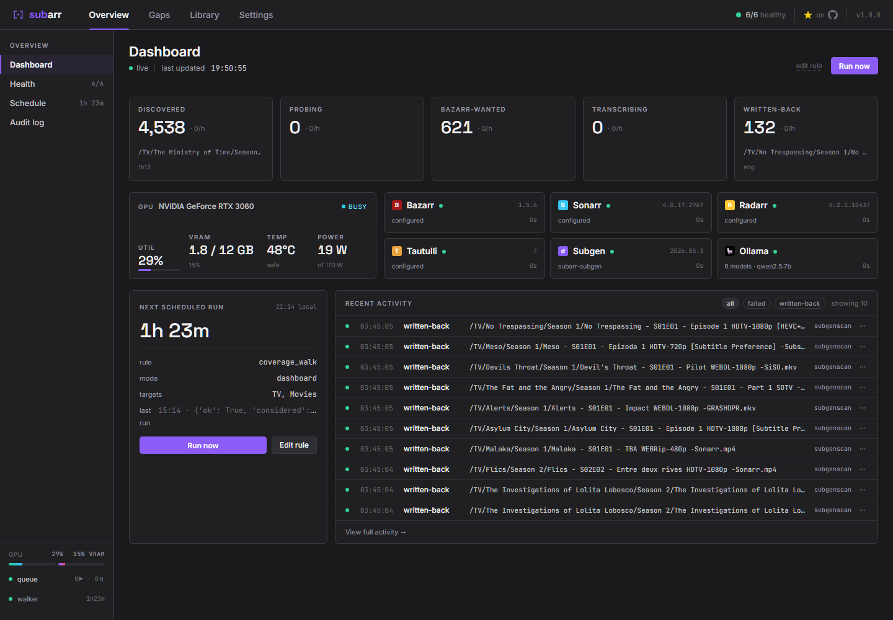

**Coverage** — the scored gap list with the probe-gate: verified gaps in the table, un-probed files held in "Analyzing", every explainer panel inline.

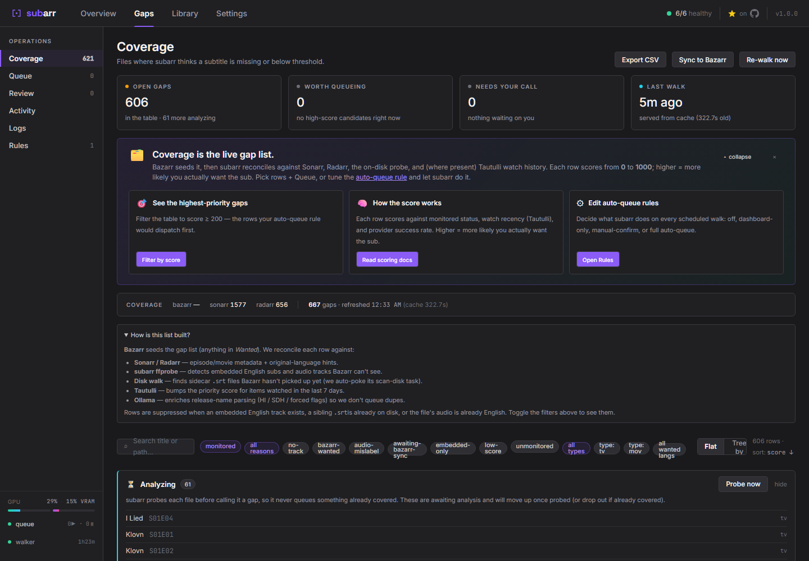

**Queue** — a real frontend for subgen: Processing / Queued / Lost-on-restart / Issues, with per-row and bulk requeue · remove · cancel.

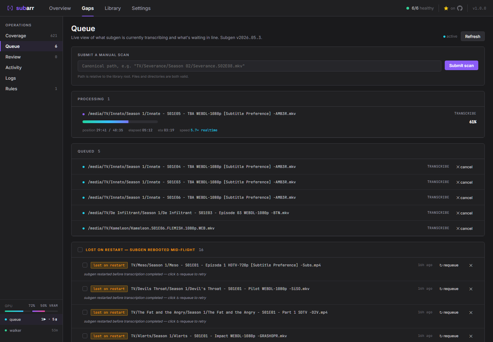

**Library** — every series and movie with audio / sub / runtime + probe-state.

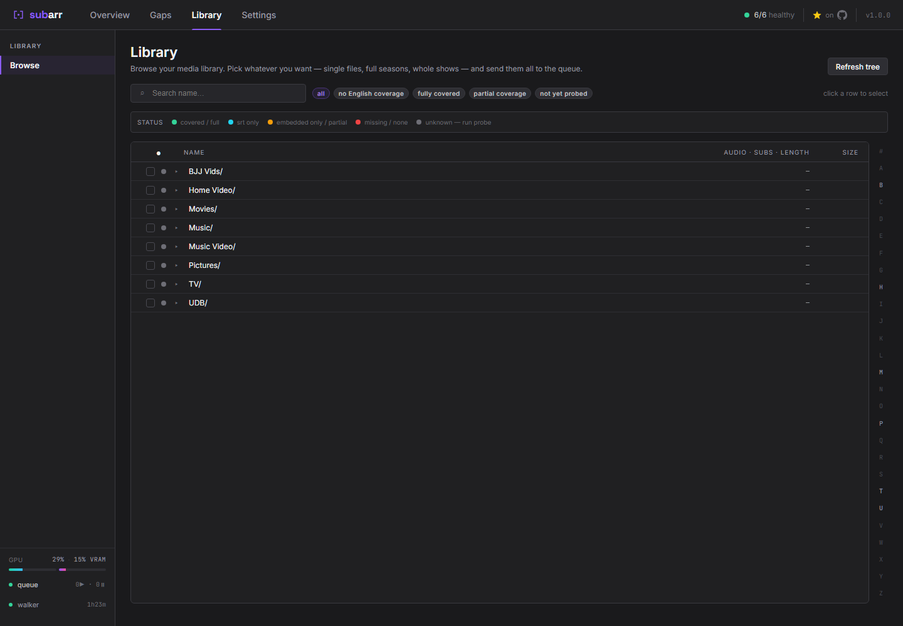

**Review** — manual audio-language verification with an audio player, multi-track support, and inline Whisper detection. In 1.1 the clip lands on actual dialogue (silero VAD), not dead air.

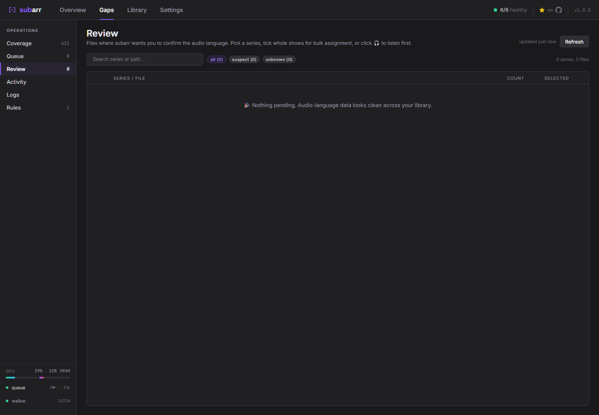

**Tuning Lab** — sweep Whisper recipes against your live subgen; a validated judge ranks them across multiple clips, with plain-language guidance and per-clip winners. Nothing is written to your library.

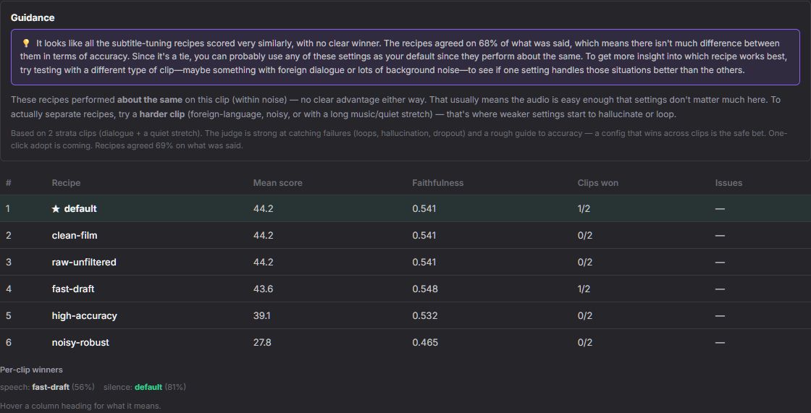

**Recipe leaderboard** — every recipe's per-language results rolled into one overall ranking (mean of per-language means, so each language counts equally). Medals for the top three, a confidence signal, and an expandable per-language breakdown.

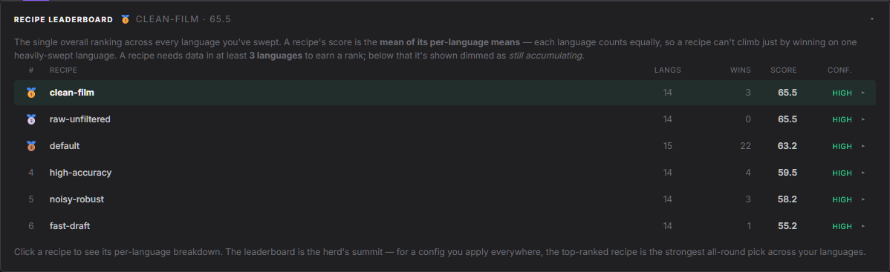

**Audio language issues** — subarr listened and disagreed with the tag: mislabeled, bilingual, and multi-track files flagged in one place, from on-demand sweeps and the opt-in library-wide scan. One click to review and confirm.

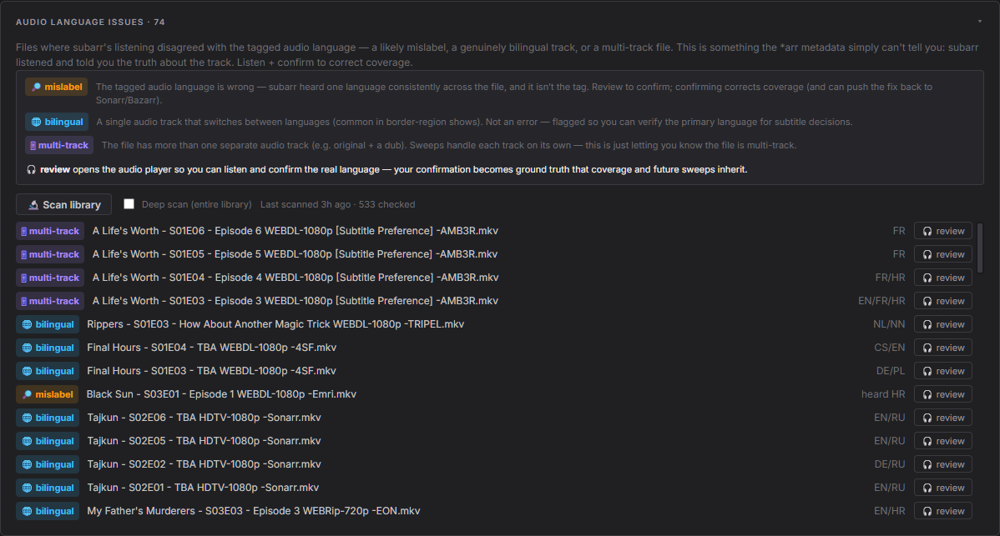

**Rules** — auto-queue policy with score thresholds and language filters, plus a live "what would queue right now?" preview.

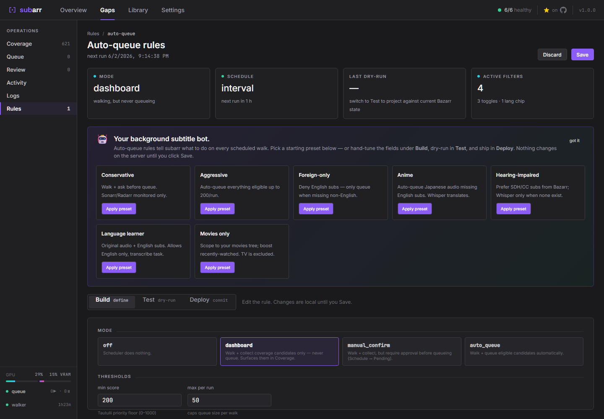

**Settings — Integrations** — live online / version / badges per service.

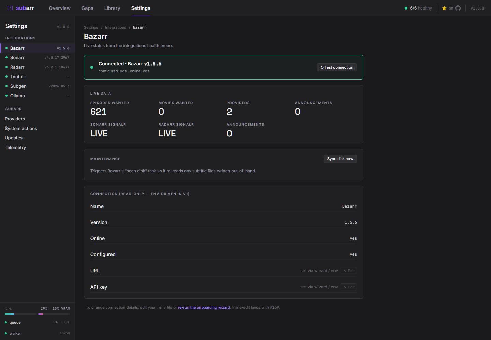

**Settings — Telemetry** — full transparency: install ID, opt-out, and the exact JSON last sent.

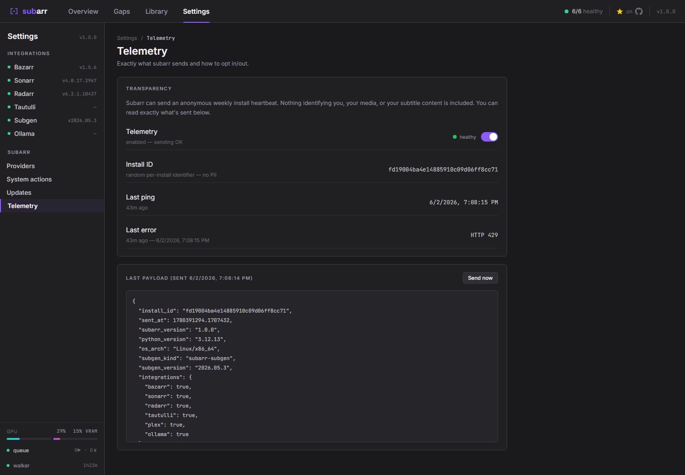

**Logs** — structured, filterable runtime logs.

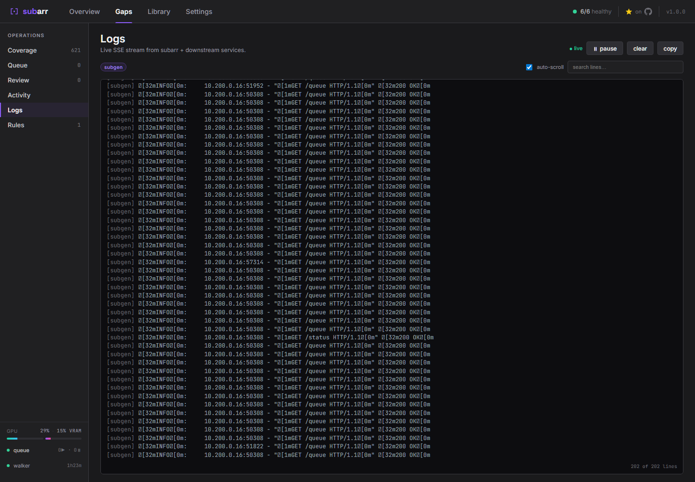

## How calibrated audio detection works

Vanilla subgen samples one 30-second window at the start of a file and trusts whatever Whisper says. That window is silent, intro music, or a foreign-language opening narration as often as not. Anime is the canonical failure case: an English-dub episode whose first 30 seconds are the Japanese OP gets transcribed in Japanese, the user gets garbage, nobody knows why.

Subarr's audio-language pipeline:

```
  L1  file metadata          ffprobe audio_language tag.
                             Cheap, often wrong on retags.

  L2  Tautulli signal        Which audio track is your household
                             actually picking when they watch?

  L3  Whisper robust detect  Sample 3 chunks across 10 / 50 / 90 percent
                             of the file. Vote by majority. Confidence
                             is the MINIMUM probability across the
                             agreeing chunks, one high-confidence
                             chunk cannot mask a disagreeing one.

  L4  user verification      Review queue surfaces every suspect row.
                             One click confirms, propagates to Sonarr
                             so Bazarr stops getting blinded.
```

Once a verification exists, every downstream submission carries it through an evidence gate. Confidence below 0.5, or missing source field, refuses to forward the override. Whisper transcribes from the audio, the way it was meant to.

## Common questions

**Is this just for anime?** No. The audio-language detection problem hits anything where the first 30 seconds of a file aren't representative: foreign-language openings on dubbed releases, silent cold opens, music-only intros, opening narrations in a different language than the dialog. Anime gets cited a lot because the OP pattern is universal across the genre, but the technical problem is general across multi-language libraries. Coverage, scheduling, provenance, and the queue UI are all language-and-genre-agnostic.

**Do I need ollama?** No. It enables two optional extras (structured enrichment and the vision pre-filter). Everything else works without it.

**Do I need Tautulli?** No, but you get NOW PLAYING boost, just-imported boost, and per-user language profiles if you have it. Without Tautulli the scheduler still works, it just has one fewer priority signal.

**Will this work with Jellyfin / Emby?** Not yet — a candidate if there's demand. Open a feature request.

## Multiple media locations (libraries)

One media root covers most setups, but if your library spans disjoint mounts — `/mnt/disk1/Movies` here, `/mnt/disk2/TV` there, a 4K library on its own share — subarr models each location as a **library**: a filesystem root (subarr's view), the prefix subgen sees it at, and the path prefix Sonarr/Radarr report it under.

- **The default library is your existing config** — `SUBARR_MEDIA_ROOT` / `SUBGEN_MEDIA_PREFIX` / `ARR_PATH_PREFIX`. A single-location install needs nothing new; nothing changes.
- **Extra libraries live in the UI** — Settings → Libraries (also offered during onboarding). Subarr reads your Sonarr/Radarr root folders and suggests any location not yet covered as a one-click "Add as library"; a manual add form covers anything auto-detect misses. Each path validates with a live reachability sample before saving, and changes apply immediately — no restart, no env vars.
- **Mount each location in subarr AND subgen** (mirrored on the *arr side), e.g.:

```yaml
# subarr
volumes:
  - /mnt/nas/Media:/media/library          # default library
  - /mnt/disk2/Movies4K:/media/disk2       # extra library (fs root: /media/disk2)

# subgen
volumes:
  - /mnt/nas/Media:/media                  # default library's subgen prefix
  - /mnt/disk2/Movies4K:/media2            # extra library's subgen prefix
```

Internally, extra libraries qualify their file keys with a stable `@<id>/` head while the default library keeps today's keys — which is why existing installs upgrade with zero migration. The simple union-mount workaround (binding several host paths under one container root) still works fine if you prefer it.

## Known limitations (v1.5)

Transparent before you install.

- Requires `ghcr.io/coaxk/subarr-subgen` for calibrated Layer 3 detection, queue cancel, curated per-language `initial_prompt`s, and the safe-decode preset. Vanilla subgen works in compat mode but you miss these.
- The default-track swap needs `mkvtoolnix` (`mkvpropedit`) in the runtime image — it ships in `ghcr.io/coaxk/subarr`; detection + the Review UI work regardless, the swap action just needs the binary present.
- No built-in multi-user auth. Basic-auth env vars exist as a single-admin fallback. Run behind a reverse proxy (Authelia / Caddy / Traefik) for anything serious.
- Auto-update is intentionally absent. Update notifications appear in the UI; you run the upgrade.
- Plex activity signal goes through Tautulli (the bridge). Reading a show's *selected* audio language straight from Plex metadata is an opt-in extra (`PLEX_AUDIO_HINTS=1`), off by default.
- Multi-episode disc images (a single `.iso` holding a whole season) can't be probed per-episode, so they're surfaced in a distinct "Couldn't analyze" (unsupported) bucket rather than becoming verified gaps or sitting in "Analyzing" forever. Standard per-episode files are unaffected.
- SQLite only. No Postgres backend.
- Single-host. Workers / multi-host are an explicit non-goal until users ask.
- Jellyfin / Emby are not yet supported.
- Compose example uses bind mounts. Named volumes work but you lose the "same path Bazarr and subgen see" sanity.

## Backing up your data

Everything subarr knows lives in two files on the `/data` volume, and some of it is genuinely irreplaceable:

- **`/data/subarr.db`** — the database. Contains your **audio-language verifications** (every "I listened and confirmed this track" click — hours of your judgment that cannot be regenerated), series language intents, the provenance ledger (which provider gave you which sub, when), Tuning Lab history, scan history, and the install's telemetry identity.
- **`/data/subarr-overrides.json`** — settings changed from the UI (credentials, libraries, toggles).

What to do about it:

- **Include `/data` in whatever backup tool you already run** (restic, borg, Backrest, duplicati — anything). Probe data and coverage rebuild themselves; verifications do not.
- For a consistent live copy of a running instance: `docker exec subarr sqlite3 /data/subarr.db ".backup /data/subarr-backup.db"`, then pick up the backup file. Copying `subarr.db` while subarr is writing can produce a torn copy (WAL); stopping the container first also works.
- **Keep `/data` on a local disk, not NFS/SMB.** SQLite in WAL mode over network filesystems is a well-known corruption hazard. Your media library on NAS is fine — that's read-mostly; the database is not.
- Subarr runs an integrity check (`PRAGMA quick_check`) on every boot. If your database is damaged you'll see it on the **Health page** and the red header pill — back up `/data` immediately at that point, before anything else writes.

## Security

- Bandit, Semgrep, pip-audit, Trivy run on every push to `coaxk/subarr` and `coaxk/subarr-subgen`. SARIF uploads to the GitHub Security tab.
- Constant-time auth comparison (`secrets.compare_digest`). Regression tested.
- API keys never appear in any HTTP response, masked surface, raw key only in dataclass internals. Regression tested.
- Every filesystem operation routes through `canonical_to_fs()` which rejects path-traversal outside the configured media root. Regression tested.
- Parameterised SQL throughout. Zero string-concat. Grepped in CI.
- `shell=False` everywhere. No user input flows into `subprocess.run`. Grepped in CI.
- Telemetry payload contents enumerated in `src/subarr/telemetry.py` with a regression test (`test_payload_never_includes_forbidden_fields`) guarding against accidental fingerprintable fields.
- Reporting a vulnerability: `security@subarr.com`. We acknowledge within 72 hours. Full policy in [`SECURITY.md`](SECURITY.md).

## Telemetry

Subarr ships with anonymous telemetry **on by default**. We are explicit about what it buys you, and the opt-out is one click in Settings and one click in the onboarding wizard.

**What gets sent:** install ID (random UUID generated locally, not a user identity), subarr version, Python version, OS / arch, subgen kind (subarr-subgen / vanilla / unreachable), subgen version, integration booleans (configured yes / no, never URLs or keys), library-size bucket (under 100 / 100-1k / 1k-10k / over 10k), scheduler mode, walks-per-day rolling average, error counts by exception class, docker tier.

**Never sent:** file paths, titles, IPs, hostnames, API keys, languages, anything user-fingerprintable. Enforced by a regression test on the client AND by an allow-list / forbidden-pattern check on the receiving Cloudflare Worker. Both pin against the same forbidden-fields list.

**What it buys you:** the Tuning Lab and recipe leaderboard shipped in 1.2 are the *local* half of a feedback loop. Telemetry is what lets the *global* half follow:
- A global Whisper-kwargs leaderboard built from aggregated telemetry. The more installs send their per-language kwargs plus verification outcomes, the more accurate the "best French settings" recommendation gets.
- A global provider success leaderboard, the same loop for Bazarr providers.
- Tuning Lab variant suggestions pre-filled from cohort data.

These cross-install loops are the next roadmap step. The reference-free quality judge they were gated on now ships (LaBSE cross-lingual adequacy, validated) — so crowd-aggregation has the trustworthy ranking signal it needs.

**Where to verify:** Settings → Telemetry shows the exact JSON of the last ping. Receiving worker source at [`coaxk/subarr-telemetry`](https://github.com/coaxk/subarr-telemetry). Public stats dashboard at [`stats.subarr.com`](https://stats.subarr.com).

**Note for Pi-hole users:** there are two subarr subdomains and they do different things.

- `telemetry.subarr.com`, the receiver your install posts heartbeats to. Privacy-conscious regex blocklists deny anything matching `*telemetry*` by default, which catches this one. That is working as intended: blocking it switches telemetry off without any further action.
- `stats.subarr.com`, the public read-only dashboard. No PII, no auth, no requests from your install, just the aggregated numbers anyone can view. Most blocklists do not catch it because the name is honest about what it is.

We picked these names deliberately. Hiding the sender behind something like `analytics.subarr.com` or putting it on the apex would be the opposite of honest. If you want telemetry off, do not allow `telemetry.subarr.com`. If you want it on, allow that one specifically rather than wildcarding the whole zone.

## Authentication

No built-in auth by default. Designed for a reverse proxy (Authelia, Caddy basicauth, Traefik forward-auth). In-product fallback is HTTP Basic via env vars:

```yaml
environment:
  SUBARR_USER: youradmin
  SUBARR_PASS: a-very-long-random-password
```

When both are set, every non-monitoring request requires Basic credentials. `/api/health` always bypasses for monitoring tools.

Honest limitations of basic auth: one global user, no per-user audit, credentials transmitted on every request. Reverse-proxy auth is the right answer for anything that matters.

## Updates

Subarr polls GitHub releases once per 24 hours for both `coaxk/subarr` and `coaxk/subarr-subgen`. The subarr-subgen comparison uses patch-stack revision so patch-level updates are detected even when upstream subgen version stays the same.

```bash
# In the directory with your compose.yaml
docker compose pull
docker compose up -d
```

The Settings panel shows the current vs latest version per product with release notes inline. No auto-update by design, you run upgrades when you know it is happening.

## Architecture

<picture>
  <source media="(prefers-color-scheme: dark)" srcset="docs/architecture-dark.png">
  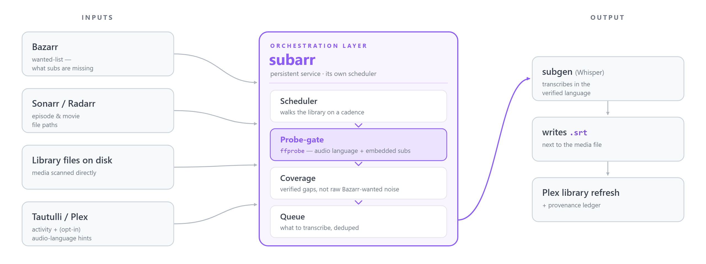
</picture>

**How it runs.** subarr is a long-running service with its own scheduler — it reads Bazarr's wanted list and walks your library on a cadence you set (and on demand from the UI). You don't wire it into Sonarr/Radarr as a custom script or trigger it manually; it just runs beside them.

| Layer | Detail |
|---|---|
| Backend | Python 3.12 + FastAPI + httpx. Async throughout. |
| Storage | Single SQLite file, default `/data/subarr.db` (override with `SUBARR_DB_PATH`). Hand-rolled migrations runner. |
| Frontend | React 18 + esbuild. CDN React. Bundles committed so `pip install` ships a working SPA. |
| Subgen drive | HTTP. 20 small patches over upstream McCloudS/subgen. Living patch stack at [`coaxk/subarr-subgen`](https://github.com/coaxk/subarr-subgen). |
| Discovery | Read-only Docker API via [tecnativa/docker-socket-proxy](https://github.com/Tecnativa/docker-socket-proxy). |
| Telemetry receiver | Cloudflare Worker + D1. Open source at [`coaxk/subarr-telemetry`](https://github.com/coaxk/subarr-telemetry). |

Three deployment tiers (full templates in [`deploy/templates/`](deploy/templates/README.md)):

| Tier | What you get | What you give up | Who it is for |
|---|---|---|---|
| 1, Standalone | Manual integration URLs, no Docker access | Auto-detect, container-name hostnames | Non-Docker hosts |
| 2, Socket proxy (recommended) | Auto-detect on your existing Docker network | Slightly more setup | Most homelabs |
| 3, Full integration | Tier 2 + API-key auto-extract from config volumes | Subarr can read every mounted config dir | Trust your single-tenant box |

## Roadmap

**v1.4 (this release):**

- **Job Aftercare** (shipped): post-transcription quality review — every finished job flagged for failures + readability, with per-row flag / language / source / score.
- **Default-track mismatch fix** (shipped): detect when a file's default audio is not the original language, with a one-click in-place track swap or dismiss.
- **Queue authority** (shipped): every submission — manual, requeue, coverage, backfill — routes through the throttled, reorderable pending queue; nothing stampedes subgen.
- **Verified segmentation default** (shipped): the tuned "strongpad" regroup baked into the `subarr-subgen` image.

*Previously: the Tuning Lab, verified audio, and the global recipe leaderboard (1.2); speech-aware audio (1.1). See the [changelog](CHANGELOG.md).*

**Later** — still on the list:

- **Provider success leaderboard**: aggregate Bazarr per-provider history across opt-in installs into a global ranking. Closes "which subtitle providers actually deliver?", a long-standing Bazarr feature request.
- **The federated tuning loop**: cross-install kwargs aggregation ranked by verification outcomes, and **"use community-best for &lt;language&gt;"** one-click adoption. The reference-free quality judge it was gated on now ships (LaBSE cross-lingual adequacy, validated).
- **First-class media-server integration**: Jellyfin / Emby backends alongside Plex.

## The subgen patch story

Subarr drives subgen through 20 small patches over upstream McCloudS/subgen. Each is independent, idempotent on reapply, required for one specific subarr orchestration behaviour. Living patch stack at [`coaxk/subarr-subgen`](https://github.com/coaxk/subarr-subgen).

The maintained image is `ghcr.io/coaxk/subarr-subgen:<tag>`. Tagged releases: `v2026.05.3-r8` current (Blackwell/RTX 50xx CUDA 12.8, gnupg CVE patch, and the verified "strongpad" segmentation baked in as the default), with `latest` and per-version tags.

You do not need our patched image. See the "I already have subgen" table at the top.

## Development

```bash
git clone https://github.com/coaxk/subarr
cd subarr
python -m venv .venv && source .venv/bin/activate
pip install -e .[dev]
PYTHONPATH=src uvicorn subarr.app:app --reload --port 9922
PYTHONPATH=src pytest -q                    # 774 passing
npm install && npm run build:frontend       # SPA bundles
```

## Related

- [Bazarr](https://github.com/morpheus65535/bazarr), the librarian. Subarr reads its wanted list and writes back its scan-disk trigger.
- [McCloudS/subgen](https://github.com/McCloudS/subgen), the worker. Subarr drives it via the patches in [`coaxk/subarr-subgen`](https://github.com/coaxk/subarr-subgen).
- [subsyncarr](https://github.com/johnpc/subsyncarr), the synchroniser. Recommended companion for sync issues subarr does not tackle.

## License

MIT. See [LICENSE](LICENSE). The patched subgen image (`ghcr.io/coaxk/subarr-subgen`) is a derived work of upstream McCloudS/subgen. See that repo's [`NOTICE`](https://github.com/coaxk/subarr-subgen/blob/main/NOTICE) for attribution.
